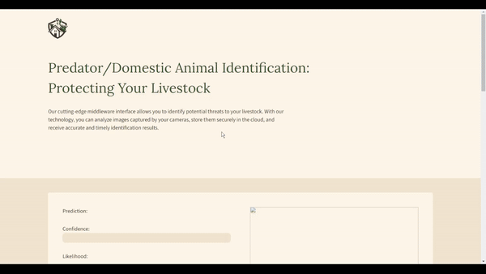

<h1 align="center">Hi 👋, I'm Wilmer Guzman</h1>
<h3 align="center">A passionate frontend developer</h3>

- 🌱 I’m currently learning **full-stack development**

- 👨‍💻 All of my projects are available at [https://codebywil.com/](https://codebywil.com/)

- 📫 How to reach me **joelguzman2468@gmail.com**

<h3 align="left">Connect with me:</h3>

<h1 align="center">Projects</h1>
<table bordercolor="#66b2b2">
  
  <tr>
    <td width="50%" valign="top">
      <h3 align="center">SafeHerd Solutions</h3>
         
        
         
        

          
    
      

        
<strong>HTML5, CSS3, Javascript, Keras, & TensorFlow</strong> - Web platform uses AI to classify animals as domestic or predators, showcasing machine learning's potential in animal behavior analysis.

    </td>
    <td width="50%" valign="top">
      <h3 align="center">Workout Buddy</h3>
         
            
         
        

          
  
      

        
<strong>MongoDB, Express.js, React.js, Node.js</strong> - Web application that helps you store information, plan, and keep track of your workouts.

    </td>
  </tr>
  
  <tr>
    <td width="50%" valign="top">
      <h3 align="center">Tic Tac Toe</h3>
       
        
       
        

  
      

        
<strong>HTML5, CSS3, & Javascript</strong> - Tic Tac Toe game that can be played with another player on the same computer or an AI that utilizes the minimax algorithm to make its choices.

    </td>
    <td width="50%" valign="top">
      <h3 align="center">Appointment System</h3>
         
          
         
        

          
  
      

        
<strong>Java, JavaFX, & MySQL</strong> - A desktop scheduling app with multilingual support, designed to simplify the management of appointments and customer interactions through user-friendly and localized features.

    </td>
  </tr>
</table>

<h3 align="left">Languages and Tools:</h3>

                           

